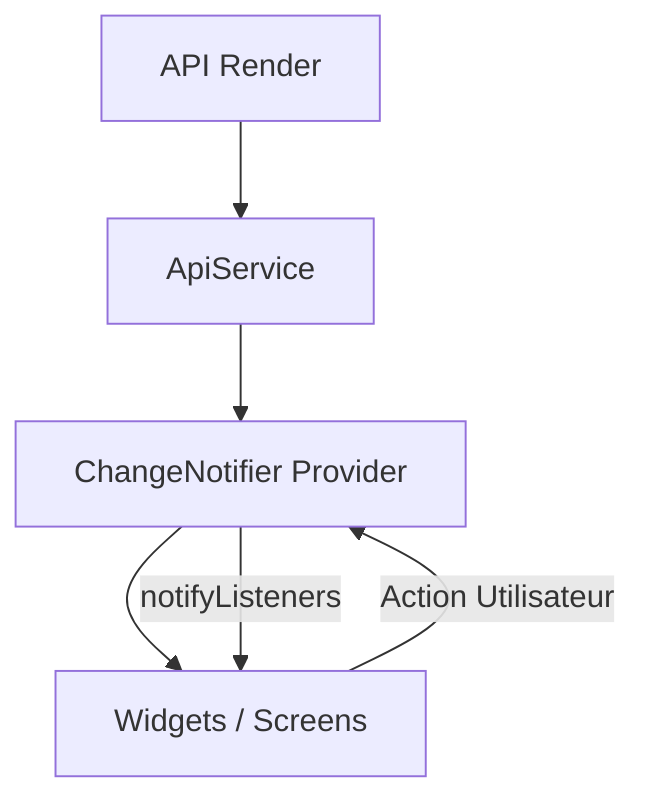

# 🏗️ Architecture de Gestion d'État avec Provider - GameMart

Cette documentation détaille l'implémentation du package `Provider` dans le projet GameMart, expliquant les choix architecturaux, les mécanismes internes et la structure des données.

## 1. Pourquoi le choix de Provider ?

Dans le cadre de l'application GameMart, `Provider` a été préféré à `setState` ou `ValueNotifier` pour les raisons suivantes :

- **Séparation des Préoccupations (SoC)** : Contrairement à `setState`, Provider permet de sortir la logique métier des fichiers UI. Les widgets ne s'occupent que de l'affichage, tandis que les classes Provider gèrent les données et les appels API.
- **Maintenabilité** : En centralisant l'état dans des classes dédiées (ex: `CartProvider`), le code devient plus facile à lire, à tester et à faire évoluer.
- **Performance** : Provider permet des reconstructions (rebuilds) ciblées. Seuls les widgets qui écoutent spécifiquement un changement sont reconstruits, contrairement à `setState` qui reconstruit souvent tout l'arbre de widgets local.
- **Injection de Dépendances** : Il facilite l'accès aux données depuis n'importe quel niveau de l'arbre des widgets sans avoir à passer des paramètres de constructeur en constructeur (Prop Drilling).

---

## 2. Cartographie de l'utilisation dans le Code

### Enregistrement Global
- **Fichier** : [main.dart](file:///c:/Users/amine/OneDrive/Bureau/developpement%20android/Hybrid/e_commerce/lib/main.dart)
- **Lignes** : 15-20 (MultiProvider)
- **Rôle** : Injecte tous les providers à la racine de l'application pour qu'ils soient accessibles partout.

### Providers Implémentés

| Provider | Fichier | Rôle Principal |
| :--- | :--- | :--- |
| `GameProvider` | [game_provider.dart](file:///c:/Users/amine/OneDrive/Bureau/developpement%20android/Hybrid/e_commerce/lib/providers/game_provider.dart) | Gère le catalogue, les filtres et les promotions. |
| `CartProvider` | [cart_provider.dart](file:///c:/Users/amine/OneDrive/Bureau/developpement%20android/Hybrid/e_commerce/lib/providers/cart_provider.dart) | Gère le panier local et le processus de checkout. |
| `UserProvider` | [user_provider.dart](file:///c:/Users/amine/OneDrive/Bureau/developpement%20android/Hybrid/e_commerce/lib/providers/user_provider.dart) | Gère l'authentification, la session et la wishlist. |
| `OrderProvider` | [order_provider.dart](file:///c:/Users/amine/OneDrive/Bureau/developpement%20android/Hybrid/e_commerce/lib/providers/order_provider.dart) | Gère l'historique des commandes utilisateur. |

---

## 3. Mécanismes de Fonctionnement

### Flux de Données (Diagramme conceptuel)


### Accès aux Données
Nous utilisons principalement deux méthodes pour accéder aux données :
1. **`Provider.of<T>(context)`** : Utilisé dans les méthodes `build` pour écouter les changements.
2. **`listen: false`** : Utilisé dans les fonctions (ex: `onPressed`) pour effectuer des actions sans reconstruire le widget inutilement.

### Exemple Concret : Ajout au Panier
Dans [game_card.dart](file:///c:/Users/amine/OneDrive/Bureau/developpement%20android/Hybrid/e_commerce/lib/widgets/game_card.dart) :
```dart
// Accès sans écoute pour l'action
final cartProvider = Provider.of<CartProvider>(context, listen: false);

onPressed: () {
  cartProvider.addItem(game); // Déclenche notifyListeners() dans le Provider
}
```

---

## 4. Documentation Exhaustive des Providers

### GameProvider
- **État** : `List<Game> _games`, `bool _isLoading`.
- **Méthodes** : `fetchGames()` (récupère les données de Render).
- **Logique** : Filtrage par genre et recherche textuelle.

### UserProvider
- **État** : `User? _user`, `bool _isLoading`.
- **Relations** : Utilise `SharedPreferences` pour charger la session au démarrage.
- **Méthodes** : `login()`, `register()`, `logout()`, `toggleWishlist()`.

### CartProvider
- **État** : `Map<String, CartItem> _items`.
- **Calculs** : `totalAmount` (get), `itemCount`.
- **Méthodes** : `addItem()`, `removeItem()`, `checkout(userId)`.

---

## 5. Bonnes Pratiques Appliquées
- **Immuabilité relative** : Les listes internes sont privées (`_`) et exposées via des getters pour éviter les modifications accidentelles hors du Provider.
- **Gestion du Loading** : Chaque opération asynchrone gère un flag `_isLoading` pour permettre à l'UI d'afficher des indicateurs de progrès.
- **Try/Catch** : Les appels API sont encapsulés dans des blocs try/catch pour éviter les crashs de l'application en cas d'erreur réseau.
